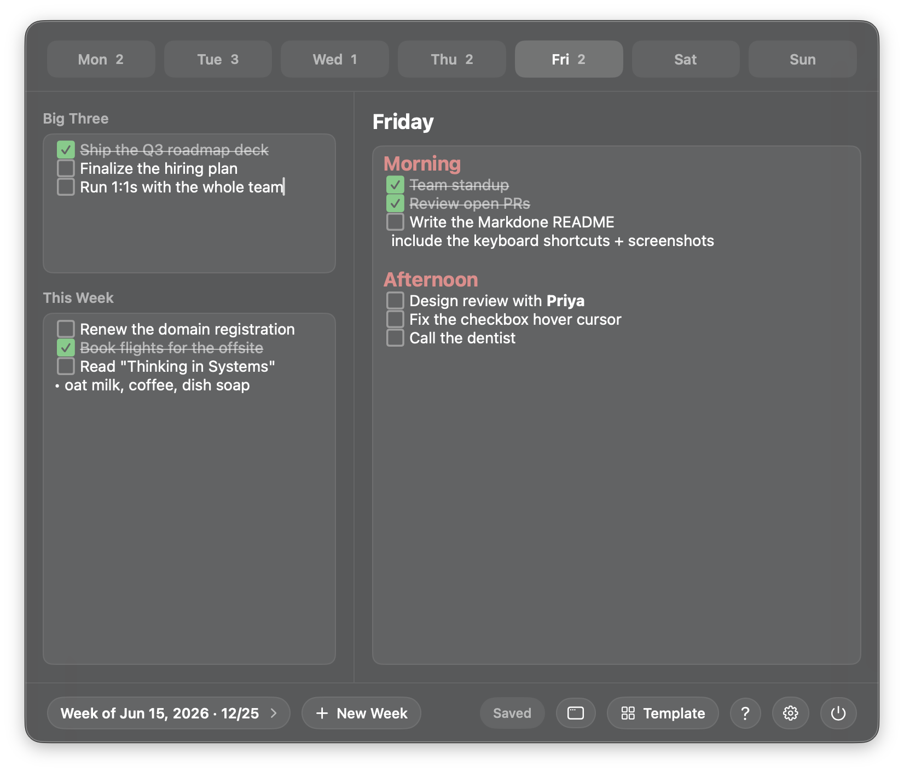
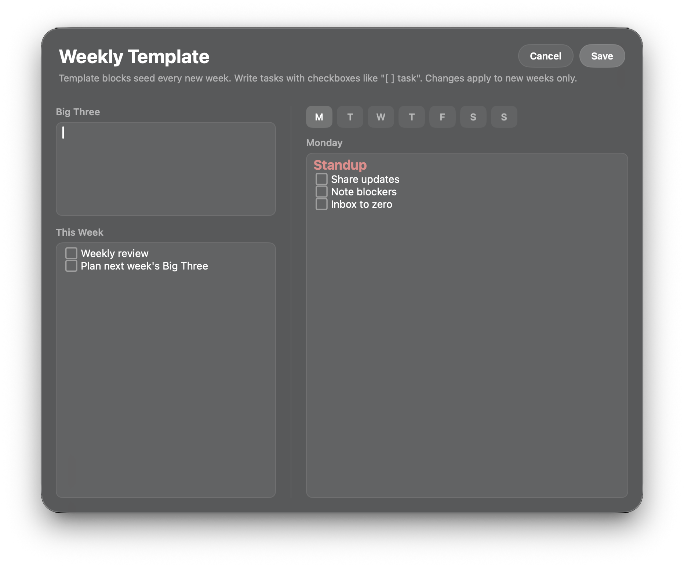
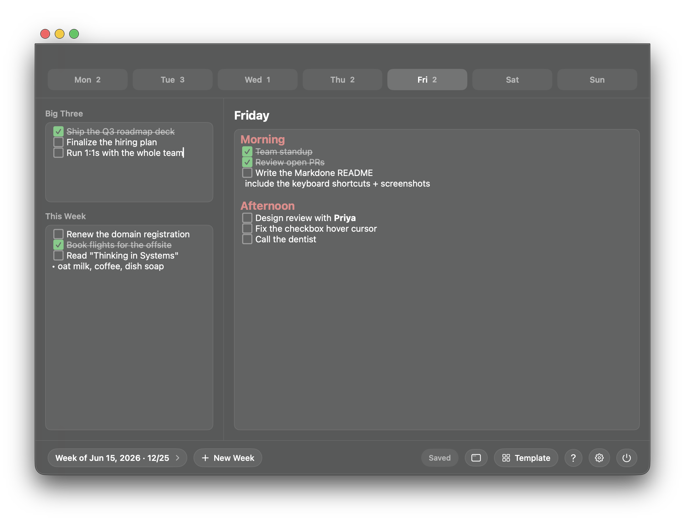

# Markdone

**Markdone** is a local macOS menu bar app for planning your week in Markdown.
Write your tasks as plain Markdown — and any `[ ]` checkbox becomes a real,
clickable box. It's "markdown," but you also *mark things done*.

<p align="center">
  
</p>

Every region — the **Big Three** priorities, the undated **This Week** list, and
each weekday — is a Markdown field that live-renders: syntax is hidden on the
line your cursor is *not* on, headings are colored, and checkboxes render as
boxes you can click. It opens as a compact dark-glass popover from the menu bar
(or pops out into a resizable window), saves to a local JSON file, and shows no
Dock icon.

## Why

It replaces a long, hand-managed Markdown file of tasks-by-day with the same
fluid plain-text editing, plus structure:

- **Write tasks as Markdown.** No forms, no buttons — just type.
- **One day at a time.** Each weekday is its own block, so there's never a long
  file to scroll. Today is selected when you open the app.
- **Recurring templates.** A weekly template seeds every new week, so your
  standard Monday (or weekly) tasks appear automatically.

## How to use it

### Open it
Click the **`[✓]`** icon in the menu bar. Markdone opens to today, showing this
week's plan. It floats and stays open until you dismiss it (Esc, `⌘W`, or
clicking the icon again).

### Write tasks
Click into any field and type. It's just Markdown:

- **Make a checkbox** — type `[] buy milk` or `- [ ] buy milk`. It renders as a
  clickable box.
- **Mark it done** — click the box. The text dims and strikes through, and the
  box turns green. Click again to un-check. The pointer turns into a hand over a
  box so you know it's clickable.
- **Add notes** — write anything under a task (indent it to nest it). It's all
  Markdown, so `## headings` are colored, `**bold**`, `*italic*`,
  `~~strikethrough~~`, `` `code` ``, `- bullets`, and `[links](url)` all render.

The line your cursor is on always shows its raw Markdown; every other line (and
every unfocused field) renders. So editing feels like a plain text file, but
reading feels like a clean checklist.

### Plan the week
- **Big Three** (top left) — your three priorities for the week.
- **This Week** (left) — anything not tied to a specific day.
- **The day panel** (right) — one weekday at a time. Switch days with the tabs;
  each tab shows how many tasks you've completed that day.
- **New Week** (bottom bar, or `⌘N`) — creates the next week, pre-filled from
  your template. The week pill shows the current week and your `done / total`
  count; click it to browse or delete past weeks.

### Recurring templates
Open the **Template** editor from the bottom bar. Put recurring tasks into the
Big Three, This Week, or any weekday block — as Markdown. Every new week starts
pre-filled with those blocks. Template edits apply to new weeks only.

<p align="center">
  
</p>

### Room to write
Need more space for longer notes? Click the **window** button in the bottom bar
to pop Markdone out into a normal resizable window. The window and the popover
share the same data, so they always stay in sync.

<p align="center">
  
</p>

### Export
**Settings → Export all weeks to Markdown…** writes a single, readable `.md`
snapshot of everything — useful for backups or sharing.

### Quit
The **power** button in the bottom bar (with a confirmation), or `⌘Q`.

## Keyboard shortcuts

Most keys belong to the focused Markdown field — it's normal text editing. The
app-level shortcuts are:

| Key | Action |
| --- | --- |
| `⌘1` … `⌘7` | Jump to Monday … Sunday |
| `⌘⌥←` / `⌘⌥→` | Previous / next day |
| `⌘N` | New week |
| `⌘W` | Close the popover or window |
| `Esc` | Close an open panel (template, settings, help) |

## Build and run

Requires macOS 14 or later. From the repository root:

```sh
./build.sh
open build/Markdone.app
```

The build script compiles the Swift sources directly with `swiftc` and assembles
a proper `.app` bundle with `LSUIElement=true`, so it runs as a menu bar
accessory. (It does not use Swift Package Manager, because SwiftPM's manifest
step does not link on a machine with only the Xcode Command Line Tools.)

To build, install to `/Applications`, and relaunch in one step:

```sh
./build.sh --install
```

## Data storage

Markdone stores everything locally:

```text
~/Library/Application Support/Markdone/data.json
```

Each region is saved as a Markdown string. There is no server, account,
analytics, or cloud synchronization — your tasks never leave your Mac.

## How it's built

Native **SwiftUI + AppKit**. Each region is an `NSTextView` with a custom
`NSLayoutManager` that draws SF Symbol checkboxes and hides Markdown syntax on
inactive lines; a small shared engine recognizes, counts, and toggles checkboxes
so the renderer, the completion counts, and click-to-toggle always agree.

> The screenshots above are captures of the running app, populated with example
> content.
